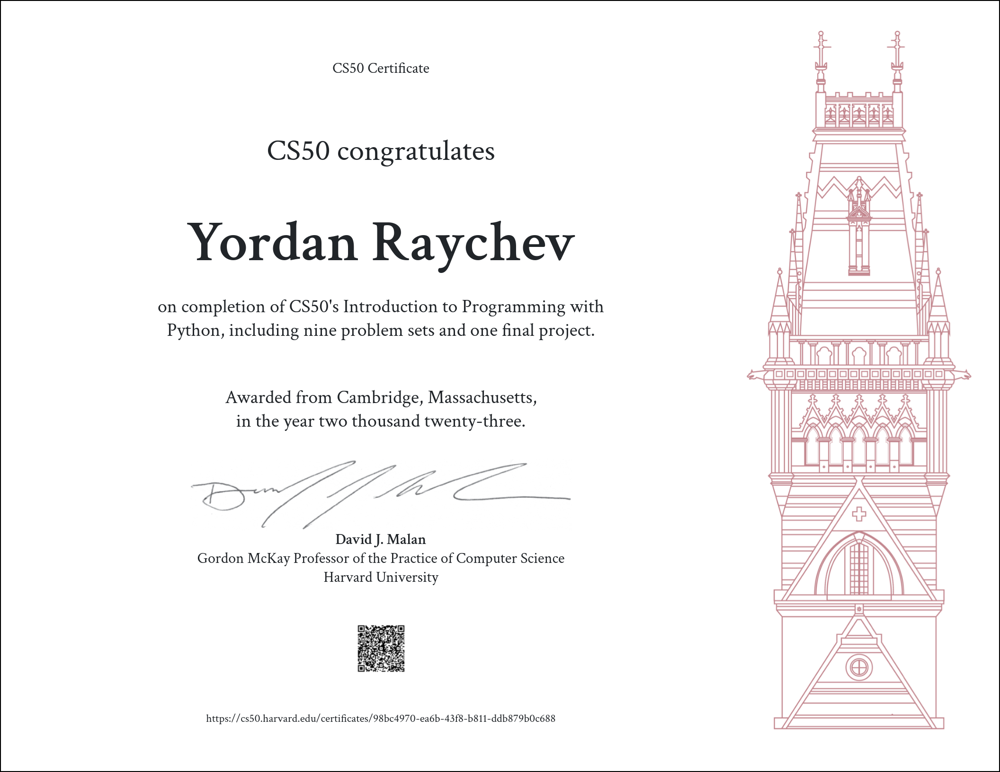

# CS50's Introduction to Programming with Python

I recently completed the 10-week-long CS50’s Introduction to Programming with Python certificate. The course covered a wide range of programming topics, including functions, variables, conditionals, loops, exceptions, libraries, unit tests, file I/O, regular expressions, and object-oriented programming. Each week introduced new concepts and challenged me to apply them through problem sets and a final project. Overall, it was an incredibly rewarding experience.

**Disclaimer:**  Copying code from others is a violation of CS50's Academic Honesty policy.
